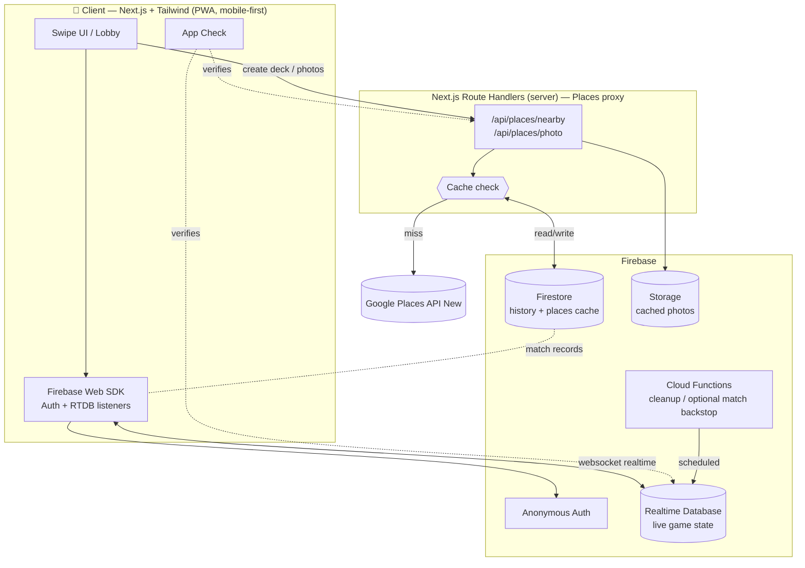
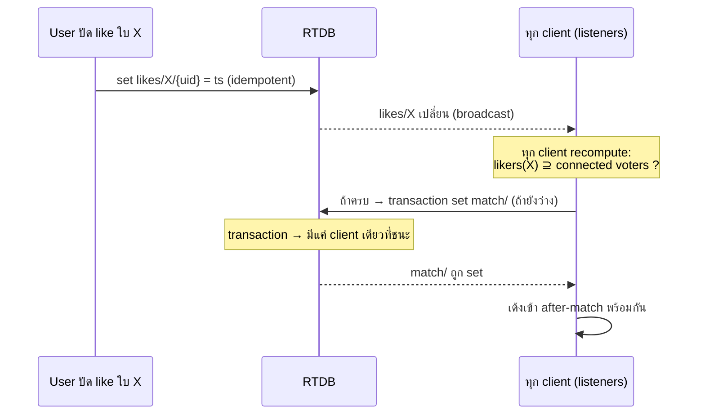

# Spec: Restaurant Match (working name)

แอป responsive สำหรับสุ่ม/แมตช์ร้านอาหารแบบ realtime ให้คู่หรือกลุ่มเพื่อน — สร้างห้อง, แชร์โค้ด 4 หลัก, ทุกคนปัดการ์ดร้านพร้อมกัน, ร้านที่ทุกคนปัด like ตรงกัน = แมตช์ โดยดึงข้อมูลร้านจริงจาก Google Maps ตามตำแหน่ง

Stack เป้าหมาย: **Next.js (App Router) + Tailwind + Firebase (Auth + Realtime Database) + Google Places API (New)**


---

## 1. ภาพรวม (Overview)

|     |     |
|-----|-----|
| **ปัญหา** | "ไม่รู้จะกินอะไร" → เถียงกัน → ไม่ได้ข้อสรุป |
| **วิธีแก้** | ให้ทุกคนปัดร้านพร้อมกัน, ระบบหา "จุดที่ทุกคนเห็นตรงกัน" ให้อัตโนมัติ |
| **Core loop** | สร้างห้อง → แชร์โค้ด → lobby → ปัดการ์ด (realtime) → **match** → after-match (พาไปกิน) |
| **กลุ่มเป้าหมาย** | คู่รัก, กลุ่มเพื่อน 2–8 คน, ครอบครัว — mobile-first |
| **เป้าหมายความเร็ว** | จากเปิดแอปถึงได้ร้าน < 60 วินาที |

หลักการออกแบบ 3 ข้อที่ทุก decision ต้องไม่ขัด:


1. **เร็วกว่าการเถียงกันเอง** — ทุก friction ที่เพิ่มต้องคุ้ม
2. **เล่นพร้อมกันแต่ไม่ต้อง lockstep** — แต่ละคนปัดตาม pace ตัวเอง, match โผล่สดๆ
3. **ต้นทุน Places API ต้องคุมได้** — cache + field mask + rate limit เป็น first-class ไม่ใช่ afterthought


---

## 2. Product Spec

### 2.1 Roles

* **Host** — คนสร้างห้อง ตั้งค่า (รัศมี/ราคา/ประเภท), กดเริ่มเกม. หลังเริ่มแล้ว role host แทบไม่สำคัญ (ห้อง self-driving)
* **Guest / Voter** — คนเข้าร่วมด้วยโค้ด/ลิงก์, ปัดการ์ด
* ไม่มีระบบ account ใน MVP — ใช้ **Firebase Anonymous Auth** (ได้ `uid` ถาวรต่อ device), ใส่ชื่อเล่น + เลือก avatar ตอนเข้าห้อง

### 2.2 Flow A — สร้างห้อง (Create Room)

```
[เปิดแอป] → [กด "สร้างห้อง"]
        → [ขอ location permission]
              ├─ อนุญาต → ใช้ geolocation
              └─ ปฏิเสธ → fallback: พิมพ์ค้นหา/ปักหมุดบนแผนที่ (Geocoding)
        → [ตั้งค่า: รัศมี, ช่วงราคา, ประเภทอาหาร, เปิดอยู่ตอนนี้]  (มี default ทั้งหมด, ข้ามได้)
        → [generate โค้ด 4 หลัก]  (เช็ค uniqueness กับห้อง active)
        → [เข้า Lobby ในฐานะ host]
```

* **โค้ด 4 หลัก** = 0000–9999 (space 10,000). เพียงพอสำหรับ MVP เพราะนับเฉพาะห้อง **active** เท่านั้น + ห้องมี TTL → โค้ดถูก recycle. ดู §3.8 (upgrade path เป็น 6 ตัวอักษรถ้าจำเป็น)
* **ลิงก์เข้าร่วม**: `app.xxx/j/{code}` — เปิดแล้วเด้งเข้า join flow พร้อมเติมโค้ดให้อัตโนมัติ
* location จับครั้งเดียวตอนสร้างห้อง แล้วใช้ค่าเดียวกันทั้งห้อง (ทุกคนเห็น deck เดียวกัน) — *ไม่ใช้* ตำแหน่งของ guest แต่ละคน เพื่อให้ deck sync และคุมต้นทุน

### 2.3 Flow B — เข้าร่วม + Lobby (Join)

```
[กด "เข้าร่วม" / เปิดลิงก์]
   → [กรอกโค้ด 4 หลัก]  (ลิงก์เติมให้แล้ว)
   → ห้องมีอยู่ & status == "lobby"?
        ├─ ใช่   → [ใส่ชื่อ+avatar] → เข้า Lobby
        ├─ ไม่มี → "ไม่พบห้องนี้ / โค้ดหมดอายุ"
        └─ active/matched → "รอบนี้เริ่มไปแล้ว" (ดู late-join §2.7 #3)
```

**Lobby** แสดง:

* รายชื่อคนในห้อง realtime (เข้า/ออกเห็นทันที) + presence dot (เขียว = online)
* ค่า setting ของห้อง (host แก้ได้, คนอื่นเห็น read-only)
* ปุ่ม **"พร้อม"** ต่อคน (optional gate) + ปุ่ม **"เริ่มเกม"** (host เท่านั้น)
* เงื่อนไขเริ่ม: ผู้เล่น ≥ 2 (solo mode = feature แยก §2.7 #6), และ (option) ทุกคนกดพร้อม

**ตอน host กด "เริ่ม":**


1. ล็อก **roster** = uid ทุกคนที่อยู่ใน lobby ตอนนั้น → กลายเป็น set ของ "voters", `voterCount = N`
2. server-side สร้าง **deck**: ยิง Nearby Search 1 ครั้ง → ได้ \~20 ร้าน → enrich (photo URL, rating, ฯลฯ) → shuffle ด้วย seed → เขียนลง `deck` (immutable)
3. `status: "lobby" → "active"`
4. ทุก client เด้งเข้าหน้า swipe พร้อมกัน

### 2.4 Flow C — Swipe Session (หัวใจ realtime)

**โมเดล: shared deck + ปัดอิสระตาม pace ตัวเอง (ไม่ lockstep)**

* ทุกคนได้ **deck ชุดเดียวกัน เรียงเหมือนกัน** (index 0..N-1)
* แต่ละคนปัดเองตามจังหวะตัวเอง → ขวา = like, ซ้าย = pass
* match จะ "โผล่" ขึ้นมาเองทันทีที่ครบเงื่อนไข (ดู §2.5) — ไม่ต้องรอให้ทุกคนปัดถึงใบเดียวกัน

UI ระหว่างปัด:

* การ์ดร้าน: รูป, ชื่อ, rating + จำนวนรีวิว, ระดับราคา (฿–฿฿฿฿), ระยะทาง, ประเภท
* progress เล็กๆ ของแต่ละคน (เช่น "เพื่อน 2/4 คนปัดถึงใบ 7 แล้ว") — สร้าง social pressure แบบสนุก
* live ticker: "🔥 2 คนชอบร้านนี้ตรงกัน!" (near-match teaser, ไม่บอกว่าใคร)

> ทางเลือก (ไม่ใช่ default): **lockstep mode** — ทุกคนดูใบเดียวกันพร้อมกัน, รอครบแล้ว reveal ("เกมโชว์ vibe"). สนุกแต่ช้าและพังง่ายเวลามีคนช้า/หลุด — แนะนำเก็บไว้ Phase 2 เป็น option

### 2.5 Match Logic

**นิยาม match (default):** ร้านใบหนึ่งจะ match เมื่อ **voter ที่ยัง connected อยู่ทุกคน** ปัด like ใบนั้น

* เริ่มจาก threshold = `voterCount` (จำนวนตอนล็อก roster)
* ถ้ามีคนหลุด (ยืนยันแล้ว, ดู §2.7 #1) → threshold ลดเหลือเท่าคน connected → คนที่เหลืออาจ match ได้ทันทีถ้าทุกคนที่เหลือเคย like ใบนั้นไว้แล้ว
* **policy การจบรอบ (เลือก 1 — เป็น open decision §6):**
  * **A) First-match-wins** *(แนะนำ MVP)* — เจอ match แรก → จบรอบ → ฉลอง → after-match. ตรงกับ use case "เลิกเถียง ไปกินเลย"
  * **B) Collect-all** — ปัดจนจบ deck แล้วโชว์ร้านที่ match ทั้งหมด เรียงตามคะแนน. ยืดหยุ่นกว่าแต่ช้ากว่า

### 2.6 After-Match (เกิดอะไรหลังแมตช์)

หน้า celebration → การ์ดร้านที่ชนะแบบเต็ม:

* รูปใหญ่, ชื่อ, rating + จำนวนรีวิว, ระดับราคา, **เปิด/ปิดตอนนี้ + เวลาทำการ**, ที่อยู่, เบอร์โทร, website
* **ปุ่มหลัก:**
  * **"ไปกันเลย" → เปิด Google Maps directions** (deep link `https://www.google.com/maps/dir/?api=1&destination_place_id={placeId}`) — *ไม่เสียค่า API* เพราะเปิดแอป Maps ไม่ใช่เรียก API
  * **โทร** (`tel:`), **ดูเมนู/เว็บ**, **แชร์ผลให้ห้อง**
* "ใครชอบบ้าง" (avatars ของ likers)
* ปุ่มรอง: **"หาร้านอื่นต่อ"** (ปัด deck ต่อ / โหลดร้านเพิ่ม), **"เริ่มรอบใหม่"**
* (option) **vote ยืนยัน** — ทุกคนกด 👍 ก่อน lock จริง กันเคส "match เพราะเผลอปัด"
* เก็บลง history (ถ้ามี account/persistence)

### 2.7 Edge cases / เคสพังต่างๆ

| #   | เคส | การจัดการ |
|-----|-----|-----------|
| 1   | **ผู้เล่นหลุดกลางเกม** | presence ผ่าน RTDB `onDisconnect`. มี **grace period \~20s** (กัน connection flap) ก่อนยืนยันว่าหลุด → ตัดออกจาก threshold. **like เดิมที่ปัดไว้ยังนับ** (ร้านที่ทุกคนรวมคนหลุด like ไว้ → ยัง match ได้) |
| 2   | **กลับเข้ามาใหม่ (reconnect)** | อ่าน room state + deck + `progress/{uid}/cursor` → ปัดต่อจากเดิม. RTDB offline persistence คิว write ให้เอง |
| 3   | **เข้าห้องหลังเริ่มแล้ว (late join)** | MVP: ปฏิเสธ "รอบนี้เริ่มแล้ว เริ่มรอบใหม่ได้เลย". Phase 2: เข้าเป็น spectator (like ไม่นับ) หรือ host เปิด lobby ใหม่ |
| 4   | **ปัดจนจบ deck ไม่มี match** | fallback: โชว์ร้านเรียงตามจำนวน like (มากสุดก่อน) + "near match" (ทุกคน like ยกเว้น 1 คน) + ปุ่ม "ขยายรัศมี / โหลดร้านเพิ่ม / เริ่มใหม่" |
| 5   | **Host ออกจากห้อง** | host สำคัญแค่ก่อนเริ่ม. ถ้าออกตอน lobby → migrate host ให้คนที่เข้าก่อน (transaction set `hostId`). หลังเริ่มแล้วห้อง self-driving ไม่ต้องมี host |
| 6   | **เหลือคนเดียว / solo** | ต้อง ≥2 ถึงเริ่ม (group). **Solo mode** = feature แยก: ปัด like ใบแรก = "ไปกินเลย" (discovery ส่วนตัว) — ใส่ Phase 2 |
| 7   | **โค้ดชนกัน** | ตอน generate ใช้ transaction เช็คกับห้อง active; ชน → สุ่มใหม่. ห้องมี TTL → recycle โค้ด |
| 8   | **ห้องค้าง / ขยะ** | ทุกห้องมี `expiresAt` (เช่น 6–12 ชม.). Scheduled Cloud Function หรือ Firestore TTL ลบทิ้ง → คืนโค้ด + ลด storage |
| 9   | **Places คืนร้านน้อย/ศูนย์** | พื้นที่ห่างไกล: auto-ขยายรัศมี → ผ่อนปรน filter → ถ้ายังน้อยกว่า deck ขั้นต่ำ (เช่น 8) แจ้ง user. ห้ามให้ deck ว่างจนเล่นไม่ได้ |
| 10  | **ปฏิเสธ location** | fallback: พิมพ์ค้นหา/ปักหมุด (Geocoding) หรือ IP coarse location. อย่า hard-block |
| 11  | **ปัดซ้ำ/รัวสองที** | write เป็น idempotent (`uid:true` set ซ้ำได้). lock การ์ดหลังปัด + debounce |
| 12  | **match ชนกันสองใบพร้อมกัน (race)** | declare match ผ่าน **transaction** บน `match/` → first-writer-wins. (policy A: ใบแรกชนะ จบรอบ) |
| 13  | **clock skew** | ใช้ `ServerValue.TIMESTAMP` เสมอ ไม่เชื่อ client clock สำหรับ ordering |
| 14  | **Network partition** | ฟัง `.info/connected` → แสดง banner "กำลังเชื่อมต่อใหม่"; RTDB คิว write ตอน offline ให้ |
| 15  | **บอท/สแปมสร้างห้อง (เผา quota)** | **App Check** (reCAPTCHA Enterprise) + rate-limit สร้างห้องต่อ uid/IP + billing alerts. นี่คือเกราะกัน Places cost runaway |


---

## 3. Technical Spec

### 3.1 สถาปัตยกรรม



**จุดสำคัญ:** realtime ไม่ต้องเขียน WebSocket server เอง — client subscribe RTDB ตรงๆ Firebase จัดการ transport + presence ให้. server (Next.js Route Handler) ทำหน้าที่เดียวคือ **proxy + cache ของ Places** เพื่อซ่อน API key และคุมต้นทุน

**Hosting:** Next.js บน Vercel หรือ Firebase Hosting ก็ได้ (Route Handlers = serverless). Cloud Functions ใช้แค่ scheduled cleanup + (optional) match backstop

### 3.2 ทำไม RTDB ไม่ใช่ Firestore สำหรับ live game

|     | **Realtime Database** ✅ live state | Firestore — durable records |
|-----|--------------------------------|-----------------------------|
| latency การ sync ถี่ๆ | ต่ำมาก เหมาะ swipe/presence    | สูงกว่า                     |
| presence (`onDisconnect`) | built-in                       | ต้อง workaround             |
| billing | คิดตาม GB stored/downloaded — ถูกสำหรับ write เล็กๆ จำนวนมาก | คิดต่อ document op — like/swipe รัวๆ แพงเร็ว |
| query ซับซ้อน | จำกัด                          | เก่ง                        |

→ **ใช้ RTDB** สำหรับ rooms/likes/presence (ephemeral), **Firestore** สำหรับ match history + places cache (durable). อย่าเอา swipe ทุกครั้งไปลง Firestore

### 3.3 Data Model

**RTDB (live, ephemeral):**

```
rooms/{code}
  meta/
    status:      "lobby" | "active" | "matched" | "ended"
    hostId:      uid
    createdAt:   ts
    expiresAt:   ts
    location:    { lat, lng, label }
    settings:    { radiusM, priceLevels:[1..4], openNow:bool, cuisine:[..] }
    roster/      { {uid}: true }     # voters ที่ล็อกตอนเริ่ม (immutable)
    voterCount:  N
    deckSize:    int
  participants/{uid}/
    name, avatar, joinedAt, ready:bool, connected:bool   # connected via onDisconnect
  deck/{index}/            # set ครั้งเดียวตอนเริ่ม, immutable
    placeId, name, photoUrl, rating, userRatingCount,
    priceLevel, distanceM, types, mapsUrl
  likes/{placeId}/{uid}:  ts        # บันทึกเฉพาะ like (pass ไม่ต้องเก็บใน MVP)
  progress/{uid}/cursor:  index     # ปัดถึงไหน (resume)
  match/                            # set ครั้งเดียว, first-writer-wins
    placeId, at, likers/{uid}: true
```

**Firestore (durable):**

```
matches/{matchId}     { code, place{snapshot}, participants[], at }
placesCache/{key}     { results[], fetchedAt, expiresAt }   # key = geohash:radius:filters
users/{uid}/history/  (Phase 1+)
```

**Storage:** `photos/{photoRefHash}.jpg` — รูปที่ resolve แล้ว, serve ผ่าน CDN, reuse ข้ามห้อง/ข้ามคน

### 3.4 Match Detection Algorithm

ปัญหาคลาสสิก: ต้องรู้ว่า "ทุกคน like ใบเดียวกัน" แบบ atomic ไม่ double-declare และทนคน crash



ทำไม robust:

* ทุก client subscribe `likes/` → ใครก็ตามที่เห็นว่าครบ จะลอง declare → **ไม่พึ่งคนสุดท้ายที่ปัด** (ถ้าคนนั้น crash คนอื่นก็เห็น like ที่ทำให้ครบอยู่ดี)
* declare ผ่าน transaction บน `match/` → set ได้ครั้งเดียว, กัน race ใบสองใบชนกัน
* threshold ใช้ "connected voters" → คนหลุดแล้ว match ที่เหลือยังเดินต่อได้

> **Optional hardening (Phase 2):** Cloud Function trigger บน `likes/{placeId}` เช็ค completeness ฝั่ง server แล้วเขียน `match/` — authoritative สุด แต่มี cold-start latency + cost. MVP ใช้ client-side detection พอ

### 3.5 Places API Integration (New API + field mask)

* ทุก call ผ่าน **server (Next.js Route Handler)** เท่านั้น — key ไม่โผล่ฝั่ง client
* ใช้ **Places API (New)** + `FieldMask` header (เลือกเฉพาะ field ที่ใช้ = คุม SKU/ราคา ดู §4)
* **สร้าง deck = Nearby Search 1 ครั้ง/ห้อง** → ได้ \~20 ร้านพร้อม field ที่ต้องการครบ → **ไม่ต้องยิง Place Details รายร้าน** (นี่คือกุญแจคุมต้นทุน)
* **รูป**: Nearby Search คืน photo *reference* ไม่ใช่ตัวรูป → resolve ผ่าน Place Photo endpoint (เสียเงินต่อ request) → **cache ลง Storage** แล้ว reuse. lazy-load เฉพาะรูปการ์ดที่ใกล้ถึง (ไม่ preload ครบ 20 ใบ)
* **cache Nearby Search** ใน Firestore key = `geohash:radius:filters`, TTL \~2–6 ชม. → ห้องในย่านเดียวกันใช้ผลร่วมกัน

### 3.6 Security

* **API key** อยู่ server-side เท่านั้น, restrict by API + IP
* **App Check** (reCAPTCHA Enterprise) คุมทั้ง backend + RTDB → กันบอทยิงเผา quota
* **Anonymous Auth** ให้ทุกคนมี uid
* **Security Rules (RTDB):**
  * อ่าน/เขียนห้องได้เฉพาะสมาชิกห้อง
  * เขียน `likes/{placeId}/{uid}` ได้เฉพาะ `uid == auth.uid` (ปลอม like คนอื่นไม่ได้)
  * `deck/` เขียนได้ครั้งเดียวตอนเริ่ม (ห้ามแก้)
  * `match/` validate ผ่าน rule + transaction

### 3.7 Realtime / Presence detail

* `participants/{uid}/connected = true` ตอน connect, set `onDisconnect(...).set(false)` → หลุดเน็ตปุ๊บ flag เป็น false อัตโนมัติ
* ฟัง `.info/connected` ฝั่ง client แสดงสถานะการเชื่อมต่อ
* grace period 20s ก่อนตัดออกจาก threshold (กัน flap)

### 3.8 Scaling notes

* โค้ด 4 หลัก = 10,000 ห้อง active พร้อมกัน. พอสำหรับ MVP. ถ้าโต → ย้ายเป็น 5–6 base32 chars (ไม่เอาตัวสับสน 0/O, 1/I/L) ได้ \~33M+ combinations, แก้แค่ generator + validation
* RTDB sharding ไม่จำเป็นจนกว่าจะ concurrent สูงมาก (Spark = 100 concurrent connections; Blaze ไม่จำกัดแต่มี soft limit \~200k ต่อ instance)


---

## 4. ต้นทุน Google Places API

> อ้างอิงราคา Google Maps Platform ที่ Google เผยแพร่ ณ พ.ค. 2026 (อัปเดตล่าสุดในหน้า pricing 2026-05-27). หน่วย: ราคาต่อ 1,000 events, tier แรก (หลัง free cap จนถึง 100,000/เดือน)

### 4.1 การเปลี่ยนแปลงสำคัญที่ต้องรู้ก่อน

ตั้งแต่ **1 มี.ค. 2025** Google เลิกเครดิตรวม $200/เดือนแบบเดิม เปลี่ยนเป็น:

* **free cap แยกต่อ SKU ต่อเดือน** (reset ทุกเดือน) — ไม่ pool รวมกันแล้ว
* จัด SKU เป็น 3 ระดับ: **Essentials / Pro / Enterprise**
* account ใหม่ได้ **เครดิตทดลอง $300** (90 วัน)
* **Firebase ต้องใช้ Blaze plan** (เพราะ Cloud Functions / การยิง external API จาก server ต้องการ Blaze; Blaze ยังรวม free tier เดิมไว้ จ่ายเฉพาะส่วนเกิน)

### 4.2 SKU ที่แอปนี้ใช้

| SKU | Free cap/เดือน | ราคา/1,000 | ใช้ตรงไหน |
|-----|----------------|------------|-----------|
| **Nearby Search Pro** | 5,000          | $32        | สร้าง deck (ถ้า field มีแค่ ชื่อ/รูป/location/types) |
| **Nearby Search Enterprise** | 1,000          | $35        | สร้าง deck (ถ้าเพิ่ม `rating`, `priceLevel`) |
| **Nearby Search Enterprise + Atmosphere** | 1,000          | $40        | สร้าง deck (ถ้าเพิ่ม `openingHours`/reviews) |
| **Place Details Photos** | 1,000          | $7         | ดึงรูปแต่ละใบ |
| **Place Details Enterprise + Atmosphere** | 1,000          | $25        | (option) ข้อมูลเต็มร้านที่ match |
| **Geocoding** | 10,000         | $5         | fallback ตอนพิมพ์หา location |

> SKU ที่ถูกเรียกเก็บ = **tier สูงสุดที่ field mask แตะ**. ถ้า field mask ของ Nearby Search มี `rating`/`priceLevel` → โดน Enterprise; ถ้ามี opening hours → Enterprise+Atmosphere. ฉะนั้น **field mask = คันโยกราคาหลัก**

### 4.3 ต้นทุนต่อห้อง (deck 20 ใบ)

| รายการ | จำนวน/ห้อง | คิดเป็น |
|--------|------------|---------|
| Nearby Search (Enterprise, มี rating+price) | 1 call     | \~$0.035 |
| Place Photos (20 ใบ, **ถ้าไม่ cache**) | 20         | \~$0.14 |
| Place Photos (cache \~50% / lazy-load) | \~10       | \~$0.07 |
| Place Details หลัง match | 0–1        | \~$0 (ใช้ data จาก deck ได้เลย) |

→ **\~$0.04 (ไม่นับรูป) ถึง \~$0.18/ห้อง (รูปไม่ cache เต็มที่)**. **รูปคือตัวแพงสุด** ไม่ใช่ search

### 4.4 ประมาณการรายเดือน

สมมติ Nearby Search ใช้ tier Enterprise, photo cache hit \~50% (≈10 รูป billed/ห้อง):

| ปริมาณ | Search | Photos | รวมโดยประมาณ |
|--------|--------|--------|--------------|
| **1,000 ห้อง/เดือน** | 1,000 calls → ฟรี (≤ cap 1,000) ≈ $0 | 10,000 req → (10,000−1,000)/1,000 × $7 = **$63** | **\~$63/เดือน** |
| 1,000 ห้อง, **รูปไม่ cache** (20/ห้อง) | \~$0   | 20,000 → \~**$133** | \~$133/เดือน |
| **10,000 ห้อง/เดือน** | (10,000−1,000)×$35/1,000 = **$315** | 100,000 → (100,000−1,000)×$7/1,000 = **$693** | **\~$1,000/เดือน** |

ที่ scale ใหญ่ **รูปยังครองค่าใช้จ่าย** → caching คือ lever ที่คุ้มสุด

### 4.5 คันโยกลดต้นทุน (เรียงตามผลกระทบ)


1. **Cache รูปลง Storage/CDN + lazy-load** เฉพาะการ์ดที่กำลังจะเห็น (ไม่ preload 20 ใบ) — ลดได้มากสุด
2. **Cache Nearby Search** ตาม geohash+radius (\~ชม.) — ห้องในย่านเดียวกัน reuse
3. **Deck เล็กลง** (12–15 ใบ แทน 20) — ลดทั้ง search overhead และรูป
4. **เลือก tier ให้พอดี** — ถ้าไม่จำเป็นต้องโชว์ rating/price บนการ์ด ใช้ Pro ($32, free 5,000) แทน Enterprise (free แค่ 1,000)
5. **App Check + rate limit** — กันบอทเผา quota (ทั้ง security ทั้ง cost)
6. **ตั้ง billing alerts + quota caps** ใน Google Cloud — กันบิลพุ่งไม่รู้ตัว (ของ Places ไม่มี hard cap ในตัว ต้องตั้งเอง)

### 4.6 Firebase cost

สำหรับ scale MVP **อยู่ใน free tier สบายๆ** — game state เป็น KB ต่อห้อง. ต้องเปิด **Blaze** (เพื่อ external API/functions) แต่ Blaze รวม free allowance เดิมไว้ จ่ายเฉพาะส่วนเกิน ซึ่งสำหรับข้อมูลเล็กๆ แบบนี้แทบเป็นศูนย์เทียบกับ Places. *(อัตรา Firebase ละเอียดควรเช็คหน้า pricing ปัจจุบันก่อนวางแผนจริง)*


---

## 5. MVP scope & phasing

**Phase 0 — MVP (เล่นจบ loop ได้):**

* Anonymous Auth + ชื่อ/avatar
* สร้าง/เข้าห้อง (โค้ด 4 หลัก + ลิงก์) + lobby + presence
* location (geolocation + manual fallback)
* deck เดียวจาก Nearby Search 1 call + field mask
* ปัดอิสระ shared deck + unanimous match (first-match-wins)
* after-match: การ์ดเต็ม + ปุ่มไป Google Maps + โทร/แชร์
* room TTL + cleanup, Places proxy + cache, App Check, security rules, billing alerts

**Phase 1:** filters (ราคา/ประเภท/เปิดตอนนี้), reconnect/resume, host migration, no-match fallback (เรียง like + near-match), photo cache เต็มรูปแบบ, match history

**Phase 2:** vote ยืนยันก่อน lock, reactions, "โหลดร้านเพิ่ม"/pagination, solo mode, lockstep mode (option), share results, analytics, Cloud Function match backstop

**Phase 3:** account/social, favorites, group history, web push, (พิจารณา) monetization


---

## 6. Open decisions (ต้องเคาะ)


1. **จบรอบยังไง** — first-match-wins (เร็ว, ตรง use case) vs collect-all-and-rank (ตัวเลือกเยอะ)?  → แนะนำ first-match-wins ใน MVP
2. **Roster** — ล็อกตอนเริ่ม (แนะนำ) vs ปรับ dynamic ระหว่างเล่น?
3. **คนหลุด** — ลด threshold (แนะนำ) vs บล็อก match จนกว่าจะกลับมา?
4. **Deck source** — Nearby Search ครั้งเดียว \~20 (ถูก) vs paginate เพิ่มความหลากหลาย (แพงขึ้น)?
5. **Field/tier** — Enterprise+Atmosphere (มีเวลาทำการบนการ์ด, $40, free 1,000) vs Pro (ไม่มี rating/price บนการ์ด, $32, free 5,000)?
6. **Solo mode** — ทำใน MVP หรือเลื่อนไป Phase 2?


