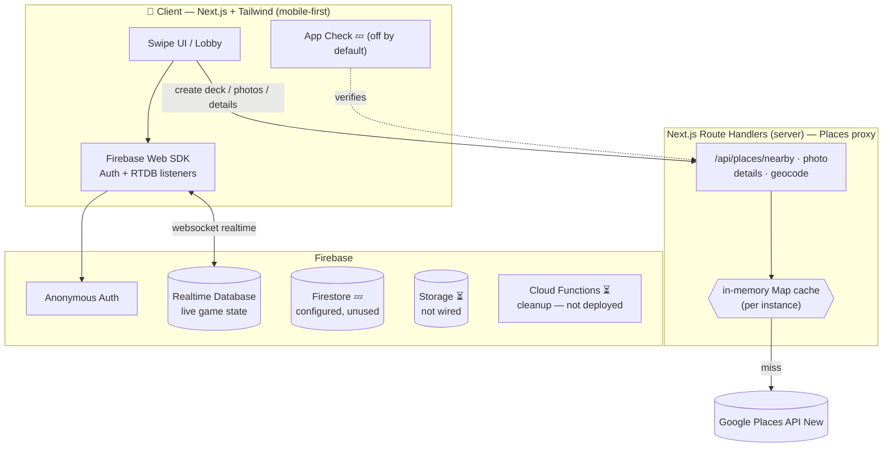
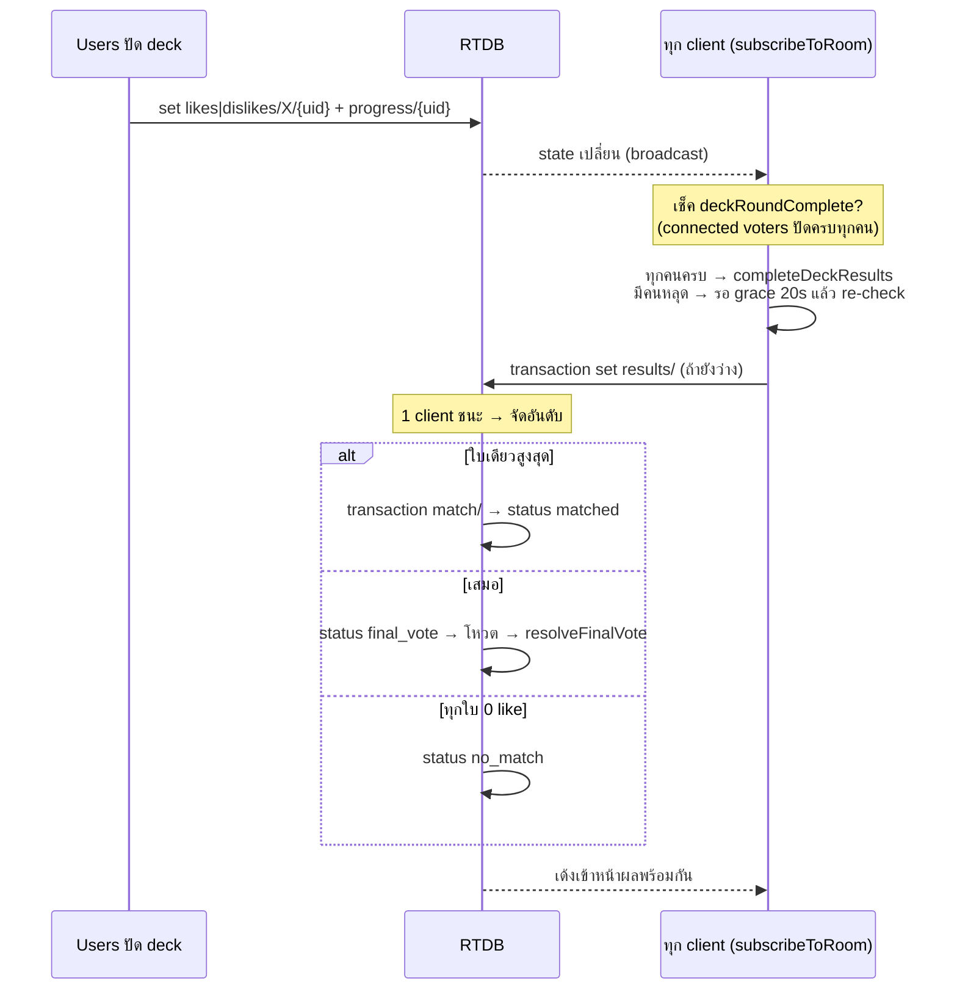

# ไม่รู้กินไร (kin-rai-dee)

แอป responsive สำหรับสุ่ม/แมตช์ร้านอาหารแบบ realtime ให้คู่หรือกลุ่มเพื่อน — สร้างห้อง, แชร์โค้ด 4 ตัว, ทุกคนปัดการ์ดร้านพร้อมกัน, จบรอบแล้วระบบจัดอันดับร้านที่ทุกคนถูกใจตรงกันมากสุดให้อัตโนมัติ โดยดึงข้อมูลร้านจริงจาก Google Places ตามตำแหน่ง

Stack: **Next.js 16 (App Router + Turbopack) + React 19 + Tailwind v4 + Firebase (Anonymous Auth + Realtime Database) + Google Places API (New)**

> เอกสารนี้เป็น **as-built** — สะท้อนสิ่งที่ build จริงในโค้ด ไม่ใช่แค่ spec ตั้งต้น แต่ละหัวข้อมี status marker:
>
> | | |
> |---|---|
> | ✅ | implemented & ใช้งานได้ |
> | 🟡 | partial — มีบางส่วน |
> | ⏳ | ยังไม่ทำ / เลื่อนไป phase หลัง |
> | 💤 | configured แต่ยังไม่ถูกเรียกใช้ |
>
> **จุดที่ as-built ต่างจาก spec เดิมอย่างมีนัยสำคัญ:** match policy เป็น **collect-all + จัดอันดับ + โหวตตัดสิน** (ไม่ใช่ first-match-wins) · เก็บทั้ง `likes` และ `dislikes` · `meta` แบนเป็น `filters` ก้อนเดียว · เพิ่ม status `final_vote`/`no_match` + node `results`/`finalVote`/`dislikes` · **Firestore/Storage ยังไม่ถูกใช้** (cache เป็น in-memory) · โค้ดเป็น base32 4 ตัว (อัปจาก 0000–9999)


---

## 1. ภาพรวม (Overview)

|     |     |
|-----|-----|
| **ปัญหา** | "ไม่รู้จะกินอะไร" → เถียงกัน → ไม่ได้ข้อสรุป |
| **วิธีแก้** | ให้ทุกคนปัดร้านพร้อมกัน, ระบบหา "จุดที่ทุกคนเห็นตรงกัน" ให้อัตโนมัติ |
| **Core loop** | สร้างห้อง → แชร์โค้ด → lobby → ปัดการ์ด (realtime) → ทุกคนปัดครบ → **จัดอันดับ** → ชนะ / โหวตตัดสิน / ไม่แมตช์ → after-match |
| **กลุ่มเป้าหมาย** | คู่รัก, กลุ่มเพื่อน 2–8 คน, ครอบครัว — mobile-first |
| **เป้าหมายความเร็ว** | จากเปิดแอปถึงได้ร้าน < 60 วินาที |

หลักการออกแบบ 3 ข้อที่ทุก decision ต้องไม่ขัด:


1. **เร็วกว่าการเถียงกันเอง** — ทุก friction ที่เพิ่มต้องคุ้ม
2. **เล่นพร้อมกันแต่ไม่ต้อง lockstep** — แต่ละคนปัดตาม pace ตัวเอง, ผลโผล่สดๆ เมื่อทุกคนปัดครบ
3. **ต้นทุน Places API ต้องคุมได้** — field mask + cache + App Check เป็น first-class ไม่ใช่ afterthought


---

## 2. Product Spec

### 2.1 Roles

* **Host** — คนสร้างห้อง ตั้งค่า (รัศมี/ราคา/ประเภท), กดเริ่มเกม. หลังเริ่มแล้ว role host แทบไม่สำคัญ (ห้อง self-driving)
* **Guest / Voter** — คนเข้าร่วมด้วยโค้ด/ลิงก์, ปัดการ์ด
* ✅ ไม่มีระบบ account — ใช้ **Firebase Anonymous Auth** (ได้ `uid` ถาวรต่อ device), ใส่ชื่อเล่น + เลือก **avatar (SVG)** ตอนเข้าห้อง

### 2.2 Flow A — สร้างห้อง (Create Room)  ✅

```
[เปิดแอป] → [กด "สร้างห้อง"]
        → [ขอ location permission]
              ├─ อนุญาต → ใช้ geolocation
              └─ ปฏิเสธ/ไม่ได้ → ต้องเปิดสิทธิ์ตำแหน่งก่อน (manual search = ⏳ ปิดไว้)
        → [ตั้งค่า: รัศมี, ช่วงราคา, ประเภทอาหาร, เปิดอยู่ตอนนี้]  (มี default ทั้งหมด, ข้ามได้)
        → [generate โค้ด 4 ตัว]  (เช็ค uniqueness กับห้องที่มีอยู่)
        → [เข้า Lobby ในฐานะ host]
```

* **โค้ด 4 ตัว = base32** (`ABCDEFGHJKLMNPQRSTUVWXYZ23456789`, ตัด 0/O/1/I/L ที่สับสน) → ~1.05M combinations. *(อัปจาก spec เดิม "0000–9999" ตาม upgrade path §3.8 ไปแล้ว)*
* uniqueness: probe `rooms/{code}/meta/status` (node เดียวที่อ่านได้ก่อนเป็นสมาชิก) ชน → สุ่มใหม่สูงสุด 12 ครั้ง
* **ลิงก์เข้าร่วม**: `app.xxx/j/{code}` — เปิดแล้วเด้งเข้า join flow พร้อมเติมโค้ดให้อัตโนมัติ ✅
* location จับครั้งเดียวตอนสร้างห้อง แล้วใช้ค่าเดียวกันทั้งห้อง (ทุกคนเห็น deck เดียวกัน) — *ไม่ใช้* ตำแหน่งของ guest แต่ละคน เพื่อให้ deck sync และคุมต้นทุน

### 2.3 Flow B — เข้าร่วม + Lobby (Join)  ✅

```
[กด "เข้าร่วม" / เปิดลิงก์]
   → [กรอกโค้ด 4 ตัว]  (ลิงก์เติมให้แล้ว)
   → ห้องมีอยู่ & ยังไม่หมดอายุ & status == "lobby"?
        ├─ ใช่   → [ใส่ชื่อ+avatar] → เข้า Lobby
        ├─ ไม่มี → "ไม่พบห้องรหัส ... หรือโค้ดหมดอายุ"
        ├─ หมดอายุ (expiresAt < now) → "ห้อง ... หมดอายุแล้ว" (lazy expiry §2.7 #8) ✅
        └─ active/อื่นๆ → "รอบนี้เริ่มไปแล้ว" (ดู late-join §2.7 #3)
```

**Lobby** แสดง:

* รายชื่อคนในห้อง realtime (เข้า/ออกเห็นทันที) + presence dot (เขียว = online), badge โฮสต์
* ค่า setting ของห้องเป็น tag (host แก้ได้, คนอื่นเห็น read-only)
* ปุ่ม **"พร้อม"** ต่อคน (optional — โชว์สถานะ แต่ **ไม่ได้ใช้เป็น gate บังคับ**) + ปุ่ม **"เริ่มเกม"** (host เท่านั้น)
* เงื่อนไขเริ่ม: ผู้เล่น **≥ 2** (solo mode = §2.7 #6 ⏳)

**ตอน host กด "เริ่ม":** ✅


1. ล็อก **roster** = uid ทุกคนที่อยู่ใน lobby ตอนนั้น → set ของ "voters", `voterCount = N`
2. สร้าง **deck**: ยิง Nearby Search 1 ครั้ง → ได้ ~20 ร้าน → map เป็น Restaurant snapshot → shuffle (Fisher–Yates) → เขียนลง `deck` (immutable)
3. `status: "lobby" → "active"`, reset `likes/dislikes/progress/results/finalVote/match`
4. ทุก client เด้งเข้าหน้า swipe พร้อมกัน

### 2.4 Flow C — Swipe Session (หัวใจ realtime)  ✅

**โมเดล: shared deck + ปัดอิสระตาม pace ตัวเอง (ไม่ lockstep)**

* ทุกคนได้ **deck ชุดเดียวกัน เรียงเหมือนกัน** (index 0..N-1)
* แต่ละคนปัดเองตามจังหวะตัวเอง → ขวา = like, ซ้าย = pass (เก็บทั้งคู่: `likes`/`dislikes`)
* แต่ละ swipe เขียน `likes|dislikes/{restaurantId}/{uid}` + `progress/{uid}` พร้อมกันแบบ atomic
* ผลแมตช์/อันดับ **โผล่หลังทุกคนปัดครบ deck** (ดู §2.5) — collect-all ไม่ใช่ first-match

> ⏳ **lockstep mode** (ทุกคนดูใบเดียวกันพร้อมกันแล้ว reveal) — ยังไม่ทำ, เก็บไว้ Phase 2

### 2.5 Match Logic  ✅  *(as-built = Collect-all, ต่างจาก spec เดิมที่แนะนำ first-match-wins)*

**จบรอบเมื่อ voter ที่ยัง connected ทุกคนปัดครบ deck** (คนหลุดไม่บล็อก — ดู §2.7 #1) แล้ว compute ครั้งเดียว:

```
1. rankDeck: ให้คะแนนทุกใบด้วยจำนวน like จาก voter ใน roster
   เรียง: likes ↓ → likePct ↓ → deckIndex ↑
2. ทุกใบ likes == 0  → status "no_match"  (โชว์หน้า no-match)
3. มีใบเดียวที่คะแนนสูงสุด → declareWinner → status "matched"
4. คะแนนสูงสุดเสมอกันหลายใบ → status "final_vote" (รอบโหวตตัดสิน)
```

**รอบโหวตตัดสิน (`final_vote`):** ✅

* `finalVote.options` = ร้านที่คะแนนตันเสมอกัน, แต่ละคนโหวตได้ 1 ร้าน (`votes/{uid}`)
* resolve เมื่อ connected voter โหวตครบ → นับคะแนน (รวมโหวตของคนที่หลุดด้วย)
  * ได้ผู้ชนะเดี่ยว → `declareWinner` → `matched`
  * ยังเสมอ → เปิดรอบใหม่ (`round + 1`) ด้วยเฉพาะร้านที่เสมอ → วนจนเหลือ 1

**Concurrency:** ทุก transition (`results`, `finalVote`, `match`) guard ด้วย **RTDB transaction** → client หลายเครื่องสังเกตเห็นการจบรอบพร้อมกันได้ แต่เขียนจริงได้คนเดียว (first-writer-wins) ดู §3.4

### 2.6 After-Match (เกิดอะไรหลังแมตช์)

**หน้าผลแบ่งตาม status:**

* **`matched`** → results screen: การ์ดร้านที่ชนะ + อันดับร้านอื่น (`ถูกใจ X/N`) ✅
* **`no_match`** → no-match screen: "ยังไม่มีร้านที่ทุกคนถูกใจตรงกัน" + ปุ่มสุ่มชุดใหม่/เริ่มใหม่ ✅
* **`final_vote`** → final-vote screen: เลือกร้านที่เสมอ + progress "โหวตแล้ว X/N" ✅

การ์ดร้านที่ชนะ: รูป, ชื่อ, rating + รีวิว, ราคา, **เปิด/ปิด + เวลาทำการ, ที่อยู่, เบอร์, website** (เติมจาก Place Details ตอนนี้ — §3.5) + avatars ของคนที่ถูกใจ

* **ปุ่มหลัก — "นำทาง" → Google Maps directions** (deep link, ไม่เสียค่า API) ✅
* ปุ่มรอง: โทร (`tel:`), เว็บ, **"สุ่มร้านชุดใหม่"** (= `restartRound`, สร้าง deck ใหม่ทั้งชุดด้วย roster เดิม), **"กลับหน้าหลัก"** ✅
* ⏳ **vote ยืนยันก่อน lock** (กันเผลอปัด) — ยังไม่ทำ (`finalVote` เป็น tie-break คนละเรื่อง)
* ⏳ เก็บลง history — ยังไม่ทำ (ดู §3.3 Firestore 💤)

### 2.7 Edge cases / เคสพังต่างๆ

| #   | เคส | สถานะ | การจัดการจริง |
|-----|-----|:---:|-----------|
| 1   | **ผู้เล่นหลุดกลางเกม** | ✅ | presence ผ่าน `onDisconnect`. **grace ~20s** (`DISCONNECT_GRACE_MS`) แล้ว re-read state สดอีกครั้ง → ตัดออกจาก threshold เฉพาะถ้ายังหลุดอยู่ (กัน flap + reconnect). **like เดิมยังนับ** ในการจัดอันดับ |
| 2   | **กลับเข้ามาใหม่ (reconnect)** | 🟡 | resume จาก `progress/{uid}` cursor ✅ + RTDB offline persistence คิว write. *(ยังไม่มี reconnect banner — ดู #14)* |
| 3   | **เข้าห้องหลังเริ่มแล้ว** | ✅ | ปฏิเสธ "รอบนี้เริ่มไปแล้ว". ⏳ spectator mode = Phase 2 |
| 4   | **ปัดจนจบไม่มี match** | ✅ | status `no_match` + `results.ranking` (เรียงตาม like) โชว์บน no-match/results screen + ปุ่มสุ่มใหม่ |
| 5   | **Host ออกจากห้อง** | ✅ | ตอน lobby → migrate `meta/hostId` ให้คนเข้าก่อนสุด (atomic). คนสุดท้ายออก → `remove` ทั้งห้อง (คืนโค้ด) |
| 6   | **เหลือคนเดียว / solo** | ⏳ | บังคับ ≥2 ถึงเริ่ม. Solo discovery = Phase 2 |
| 7   | **โค้ดชนกัน** | ✅ | probe `meta/status` ก่อน, ชน → สุ่มใหม่สูงสุด 12 ครั้ง |
| 8   | **ห้องค้าง / ขยะ** | 🟡 | ทุกห้องมี `expiresAt` (12 ชม.) + **lazy expiry** ตอน join ✅. แต่ **scheduled cleanup function ยังไม่มี** ⏳ — ตอนนี้ห้องถูกลบเมื่อคนสุดท้ายออกเท่านั้น (ห้องที่ทุกคนปิดแท็บทิ้งค้างจน TTL แต่ไม่มีตัวลบ) |
| 9   | **Places คืนร้านน้อย/ศูนย์** | ✅ | `buildDeck`: ขยายรัศมี ×2 สูงสุด 2 รอบ → ผ่อน cuisine filter → mock data เป็น last resort (ไม่ผสมกับ deck จริง) |
| 10  | **ปฏิเสธ location** | ⏳ | ตอนนี้ต้องเปิดสิทธิ์ตำแหน่งก่อนสร้างห้อง (ปุ่มค้นหาย่าน = placeholder "ฟีเจอร์ในอนาคต"). manual Geocoding search เคยทำแล้วแต่ **ปิดกลับ** รอเปิดทีหลัง |
| 11  | **ปัดซ้ำ/รัวสองที** | ✅ | write idempotent (`uid: ts` set ทับได้) + lock การ์ดหลังปัด |
| 12  | **match race (สองใบพร้อมกัน)** | ✅ | declare ผ่าน **transaction** บน `match/` → first-writer-wins |
| 13  | **clock skew** | ✅ | ใช้ `serverTimestamp()` สำหรับ ts ทั้งหมด |
| 14  | **Network partition** | 🟡 | RTDB คิว write ตอน offline ให้เอง ✅. แต่ **ยังไม่ฟัง `.info/connected`** → ไม่มี banner "กำลังเชื่อมต่อใหม่" ⏳ |
| 15  | **บอท/สแปมเผา quota** | 🟡 | **App Check (reCAPTCHA v3) wired** แต่ no-op จนกว่าจะตั้ง `NEXT_PUBLIC_RECAPTCHA_SITE_KEY` 💤. **ยังไม่มี rate-limit** ต่อ uid/IP ⏳. ต้องตั้ง billing alerts เองใน GCP |


---

## 3. Technical Spec

### 3.1 สถาปัตยกรรม



**จุดสำคัญ:** realtime ไม่ต้องเขียน WebSocket server เอง — client subscribe RTDB ตรงๆ Firebase จัดการ transport + presence ให้. server (Next.js Route Handler) ทำหน้าที่ **proxy + cache ของ Places** เพื่อซ่อน API key และคุมต้นทุน

> **สถานะ infra:** RTDB + Anonymous Auth = ใช้งานจริง. Firestore init ไว้ (`firebase.ts`) แต่ **ไม่มีโค้ดเรียกใช้** 💤. Storage/Cloud Functions ยังไม่ wired ⏳. cache เป็น in-memory Map ต่อ serverless instance (หายเมื่อ scale/redeploy)

### 3.2 ทำไม RTDB ไม่ใช่ Firestore สำหรับ live game

|     | **Realtime Database** ✅ live state | Firestore — durable records |
|-----|--------------------------------|-----------------------------|
| latency การ sync ถี่ๆ | ต่ำมาก เหมาะ swipe/presence    | สูงกว่า                     |
| presence (`onDisconnect`) | built-in                       | ต้อง workaround             |
| billing | คิดตาม GB — ถูกสำหรับ write เล็กๆ จำนวนมาก | คิดต่อ document op — swipe รัวๆ แพงเร็ว |
| query ซับซ้อน | จำกัด                          | เก่ง                        |

→ ใช้ **RTDB** สำหรับ rooms/likes/presence (ephemeral) ทั้งหมด. Firestore *ตั้งใจไว้* สำหรับ match history + places cache (durable) แต่ **ยังไม่ได้ wire** — ดู §3.3

### 3.3 Data Model

**RTDB (live, ephemeral) — as-built:** ✅

```
rooms/{code}
  meta/
    status:      "lobby" | "active" | "final_vote" | "no_match" | "matched" | "ended"*
    hostId:      uid
    createdAt:   ts          (serverTimestamp)
    expiresAt:   ts          (createdAt + 12h)
    voterCount:  N           (0 ใน lobby)
    deckSize:    int         (0 ใน lobby)
    filters/     { lat, lng, label?, radiusKm, priceMin, priceMax, openNow, cuisines[] }
    roster/      { {uid}: true }     # voters ที่ล็อกตอนเริ่ม (immutable)
  participants/{uid}/
    name, emoji, host:bool, joinedAt, ready:bool, connected:bool   # connected via onDisconnect
  deck/{index}/            # set ครั้งเดียวตอนเริ่ม, immutable. Restaurant snapshot:
    id, name, cuisine, rating, reviews, price(1-4), dist, open, hours,
    addr, phone, tags[], emoji, g[from,to], placeId?, primaryType?,
    placeTypes[]?, lat?, lng?, photoName?, website?
  likes/{restaurantId}/{uid}:    ts        # like
  dislikes/{restaurantId}/{uid}: ts        # pass (เก็บด้วย — ต่างจาก spec เดิม)
  progress/{uid}:  cursor       # ปัดถึงไหน (resume)
  results/                      # collect-all ranking, transaction-guarded
    computedAt, noMatch:bool,
    ranking/{i}/ { restaurantId, rank, deckIndex, likes, voterCount, likePct }
  finalVote/                    # รอบโหวตตัดสิน, transaction-guarded
    round, createdAt, options/{restaurantId}:true, votes/{uid}:restaurantId,
    resolved/ { winnerId, at }
  match/                        # set ครั้งเดียว, first-writer-wins
    restaurantId, at, likers/{uid}:true
```

> *`"ended"` อยู่ใน type union แต่ยังไม่มีโค้ด set ค่านี้ (reserved)

**Firestore (durable) — 💤 ตั้งใจไว้ ยังไม่ wire:**

```
matches/{matchId}     { code, place{snapshot}, participants[], at }   ⏳
placesCache/{key}     { results[], fetchedAt, expiresAt }            ⏳ (ตอนนี้เป็น in-memory)
users/{uid}/history/  (Phase 1+)                                      ⏳
```

**Storage:** `photos/{photoRefHash}.jpg` — ⏳ ยังไม่ทำ. ตอนนี้ `/api/places/photo` resolve photoUri จาก Google แล้วพึ่ง browser `Cache-Control` (1 วัน) แทน

### 3.4 Match Detection / Round Completion  ✅



ทำไม robust:

* ทุก client subscribe room → ใครเห็นว่ารอบจบก็ลอง advance ได้ → **ไม่พึ่งคนสุดท้ายที่ปัด** (คนนั้น crash คนอื่นก็เห็น state ที่ครบอยู่ดี)
* transition ทั้งหมด (`results` / `finalVote` / `match`) ผ่าน **transaction** → เขียนได้ครั้งเดียว กัน double-advance
* threshold ใช้ "connected voters"; คนหลุดผ่าน grace 20s + fresh re-check ก่อนถูกตัด (กัน flap/reconnect)

> ⏳ **Optional hardening (Phase 2):** Cloud Function เป็น server-side backstop. ตอนนี้ใช้ client-side detection ล้วน

### 3.5 Places API Integration (New API + field mask)  ✅

* ทุก call ผ่าน **server (Next.js Route Handler)** เท่านั้น — key ไม่โผล่ฝั่ง client
* 3 routes: **`/nearby`** (สร้าง deck), **`/photo`** (resolve รูป), **`/details`** (เติมข้อมูลร้านที่ชนะ). ⏳ `/geocode` (manual location search) ปิดไว้ก่อน
* ใช้ **Places API (New)** + `FieldMask` — route project response ลงเหลือ field ที่ใช้ (คุม SKU/ราคา §4)
* **สร้าง deck = Nearby Search 1 ครั้ง/ห้อง** → ~20 ร้านพร้อม field ครบ → ไม่ยิง Place Details รายร้านตอนสร้าง deck (กุญแจคุมต้นทุน)
* **รูป**: Nearby คืน photo *resource name* → resolve ผ่าน `/photo` (lazy, เฉพาะใบที่ใกล้เห็น), gradient เป็น fallback
* **Place Details** เรียก *เฉพาะ* ร้านที่ชนะ (after-match) เพื่อเติม phone/website/hours/addr/open
* **cache: in-memory `Map` ต่อ route** 🟡 — nearby round center ~110m ให้ห้องย่านเดียวกัน reuse; photo พึ่ง browser Cache-Control. ⏳ **durable cache (Firestore geohash + Storage) ยังไม่ทำ** → cache หายเมื่อ instance รีไซเคิล/scale

### 3.6 Security

* ✅ **API key** server-side เท่านั้น (`GOOGLE_PLACES_API_KEY`), แยกจาก client key
* 🟡 **App Check** (reCAPTCHA v3) wired ใน `firebase.ts` แต่ **no-op จนกว่าจะตั้ง `NEXT_PUBLIC_RECAPTCHA_SITE_KEY`** + ยังไม่ได้ enforce ฝั่ง RTDB/proxy
* ✅ **Anonymous Auth** ทุกคนมี uid
* ✅ **Security Rules (RTDB)** — `database.rules.json`:
  * อ่านห้องได้เฉพาะสมาชิก (participant); `meta/status` + `meta/expiresAt` อ่านได้ด้วย auth (สำหรับ create/join probe)
  * เขียน `likes|dislikes|progress/{...}/{uid}` ได้เฉพาะ `uid == auth.uid` + status `active`; โหวต `finalVote/votes/{uid}` เฉพาะ status `final_vote`
  * `deck/` เขียนได้เฉพาะ host; `results`/`match` validate + รับ set ครั้งเดียว
  * host migration ผ่าน `meta/hostId` (validate ว่าเป็นสมาชิก)
* ⏳ rate-limit สร้างห้องต่อ uid/IP, billing alerts — ต้องทำ/ตั้งเพิ่ม

### 3.7 Realtime / Presence detail

* ✅ `participants/{uid}/connected = true` ตอน connect + `onDisconnect(...).set(false)` → หลุดเน็ตปุ๊บ flag เป็น false. cleanup ตอน leave = cancel handler เฉยๆ (ไม่ resurrect node)
* ✅ grace 20s + re-read state สดก่อนตัด voter ออกจาก threshold (กัน flap)
* ⏳ ฟัง `.info/connected` แสดง banner เชื่อมต่อใหม่ — ยังไม่ทำ

### 3.8 Scaling notes

* ✅ โค้ด **base32 4 ตัว** (no 0/O/1/I/L) ≈ 1.05M combinations — เกินพอสำหรับ MVP. โตขึ้นเพิ่มเป็น 5–6 ตัวได้ที่ generator/validation
* RTDB sharding ไม่จำเป็นจนกว่า concurrent สูงมาก (Spark = 100 concurrent; Blaze soft limit ~200k/instance)


---

## 4. ต้นทุน Google Places API

> อ้างอิงราคา Google Maps Platform ณ พ.ค. 2026. หน่วย: ราคาต่อ 1,000 events, tier แรก (หลัง free cap จนถึง 100,000/เดือน)

### 4.1 การเปลี่ยนแปลงสำคัญที่ต้องรู้

ตั้งแต่ **1 มี.ค. 2025** Google เลิกเครดิตรวม $200/เดือน เปลี่ยนเป็น:

* **free cap แยกต่อ SKU ต่อเดือน** (ไม่ pool รวม)
* จัด SKU เป็น 3 ระดับ: **Essentials / Pro / Enterprise**
* account ใหม่ได้ **เครดิตทดลอง $300** (90 วัน)
* **Firebase ต้องใช้ Blaze plan** (ยิง external API จาก server ต้องการ Blaze; Blaze รวม free tier เดิมไว้)

### 4.2 SKU ที่แอปนี้ใช้

| SKU | Free cap/เดือน | ราคา/1,000 | ใช้ตรงไหน |
|-----|----------------|------------|-----------|
| **Nearby Search Enterprise** | 1,000          | $35        | สร้าง deck (มี `rating`, `priceLevel`) |
| **Place Details Photos** | 1,000          | $7         | `/photo` ดึงรูปแต่ละใบ |
| **Place Details Enterprise + Atmosphere** | 1,000          | $25        | `/details` ข้อมูลเต็มร้านที่ชนะ |
| **Geocoding** ⏳ | 10,000         | $5         | (เผื่ออนาคต) `/geocode` fallback ตอนพิมพ์หา location — ปิดไว้ |

> SKU ที่ถูกเรียกเก็บ = **tier สูงสุดที่ field mask แตะ** → **field mask = คันโยกราคาหลัก**

### 4.3 ต้นทุนต่อห้อง (deck 20 ใบ)

| รายการ | จำนวน/ห้อง | คิดเป็น |
|--------|------------|---------|
| Nearby Search (Enterprise) | 1 call     | ~$0.035 |
| Place Photos (lazy, **in-memory/browser cache เท่านั้น**) | ~10–20 | ~$0.07–0.14 |
| Place Details (ร้านที่ชนะ) | 0–1        | ~$0.025 |

→ ~$0.04–0.18/ห้อง. **รูปคือตัวแพงสุด** — และเพราะ **ยังไม่มี Storage cache แบบ durable** ต้นทุนรูปจริงจะเกาะค่าสูงของช่วงนี้ (cache หายเมื่อ instance รีไซเคิล)

### 4.4 คันโยกลดต้นทุน (เรียงตามผลกระทบ)

1. ⏳ **Cache รูปลง Storage/CDN** (ตอนนี้แค่ in-memory + browser) — lever ที่คุ้มสุด ยังไม่ทำ
2. 🟡 **Cache Nearby Search** — มี in-memory per-instance แล้ว, ยกระดับเป็น Firestore geohash จะ reuse ข้าม instance
3. **Deck เล็กลง** (12–15 ใบ) — ปรับ `DECK_SIZE`
4. **เลือก tier ให้พอดี** — ถ้าไม่โชว์ rating/price ใช้ Pro ($32, free 5,000) แทน Enterprise
5. ⏳ **App Check + rate limit** — กันบอทเผา quota
6. **billing alerts + quota caps** ใน GCP — Places ไม่มี hard cap ในตัว ต้องตั้งเอง


---

## 5. สถานะ MVP & phasing

**Phase 0 — MVP (เล่นจบ loop ได้):**

* ✅ Anonymous Auth + ชื่อ/avatar
* ✅ สร้าง/เข้าห้อง (base32 4 ตัว + ลิงก์) + lobby + presence
* 🟡 location: geolocation ✅ · manual Geocoding fallback ⏳ (ปิดไว้ก่อน)
* ✅ deck จาก Nearby Search 1 call + field mask
* ✅ ปัดอิสระ shared deck + **collect-all ranking + tie-break vote + no-match** *(ไม่ใช่ first-match-wins)*
* ✅ after-match: การ์ดเต็ม + Google Maps + โทร/เว็บ
* ✅ room TTL + lazy expiry, Places proxy + (in-memory) cache, security rules
* 🟡 App Check (off by default), 💤 billing alerts (ต้องตั้งเอง)
* ⏳ scheduled cleanup function

**Phase 1:** ✅ filters · 🟡 reconnect/resume (มี cursor, ไม่มี banner) · ✅ host migration · ✅ no-match fallback · ⏳ durable photo cache · ⏳ match history

**Phase 2:** ⏳ vote ยืนยันก่อน lock · ⏳ reactions · ⏳ "โหลดร้านเพิ่ม"/pagination *(ตอนนี้ "สุ่มชุดใหม่" = deck ใหม่ทั้งชุด)* · ⏳ solo mode · ⏳ lockstep mode · ⏳ share results · ⏳ analytics · ⏳ Cloud Function match backstop · ⏳ spectator (late-join)

**Phase 3:** ⏳ account/social, favorites, group history, web push, monetization


---

## 6. Open decisions — สถานะการเคาะ

1. **จบรอบยังไง** — ✅ **เคาะแล้ว: collect-all + จัดอันดับ + โหวตตัดสิน** (ไม่ใช่ first-match-wins ตามที่ spec เดิมแนะนำ)
2. **Roster** — ✅ ล็อกตอนเริ่ม
3. **คนหลุด** — ✅ ลด threshold (connected voters) + grace 20s
4. **Deck source** — ✅ Nearby Search ครั้งเดียว ~20 (+ widen/relax เมื่อ sparse). ⏳ pagination = Phase 2
5. **Field/tier** — ✅ Enterprise (มี rating/price บนการ์ด). ปรับเป็น Pro ได้ถ้าตัด rating/price
6. **Solo mode** — ⏳ เลื่อนไป Phase 2 (บังคับ ≥2)
